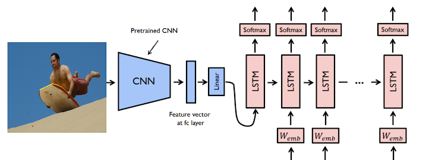
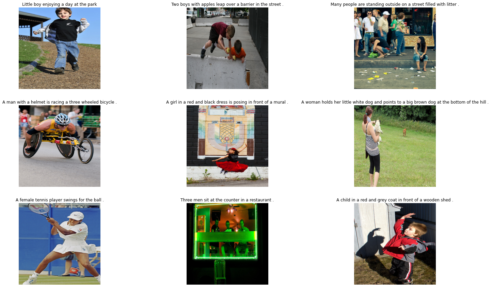

# Image Captioning

Combining Deep Learning architectures like CNN, LSTM, and MLP, I’ve built a DL model that’s capable of captioning images. This project is an intersection of computer vision and natural language processing, it’s based on encoder-decoder framework, encodes input images into intermediate representations of their contents and decodes them into descriptive text sequences.

</img>

## Project blocks:
- Data preparation block:
  - Clean the image captions
  - Get the tokenization from the captions
  - Build the dictionary(e.g {word:idx} with a threshold (number of occurrence of a word to take into consideration)
  
- Encoder:
  - Makes use of the pre-trained inception model architecture as a feature extractor
  - Returns the lower dimension version of the feature to be feeded into the Decoder block

- Decoder:
  - Embeds the captions into vector
  - Combines both embedded captions and image features fromthe encoder in order to feed into the RNN
  - Returns a probability for each word in the dictionary at each step, with number of steps equals to the pre-determined maximum caption length
  
</img>

## Using:
  - data_prep.py: 
    - prepares the caption
    - Builds dictionary
    - Does the encoding processe
    - Builds the dataloader for training
    - Prepare images pefore feeding into the encoder(size, tensor, normalization,...)
  - model.py: 
    - Builds the model (Encoder-Decoder)
  - trainer:
    - Trains the model on the prepared data
    - Save the trained model
